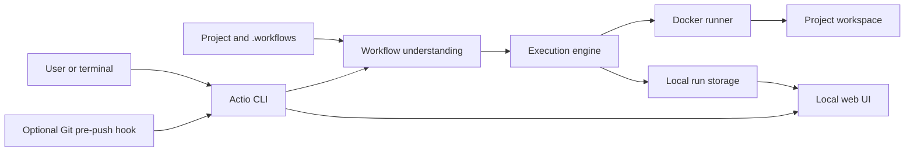

# Architecture

Actio is a local-first workflow system. A project owns its workflow definitions, while Actio owns execution, isolation, history, and reusable runtime data.

The architecture is designed around one main rule: workflow intent must stay separate from the technology used to execute and store it. Docker and local filesystem storage are current defaults, not assumptions that must shape every future version.

## System View

A workflow moves through four high-level stages:

1. **Understand**: Actio resolves and validates workflow YAML, expressions, actions, dependencies, and local configuration.
2. **Plan**: jobs are expanded, dependencies ordered, conditions evaluated, and required execution resources prepared.
3. **Run**: each job and step executes through the configured runner with logs, outputs, artifacts, and cancellation support.
4. **Observe**: run state is stored continuously and exposed through terminal output and the local web UI.

## Main Responsibilities

### Workflow Understanding

Actio treats workflow files as declarative input. Parsing and validation produce a stable internal model before execution begins.

This layer understands:

- workflow and action YAML;
- jobs, steps, dependencies, conditions, matrices, and reusable workflows;
- expressions, contexts, inputs, outputs, variables, and secrets;
- local, Docker, and external action references;
- compatibility warnings and security findings.

It does not start containers, download runtime data, or write run history.

### Execution Coordination

The execution engine turns a validated workflow into an ordered run. It owns workflow-level behavior rather than Docker details.

It coordinates:

- job dependency order and matrix variants;
- conditions, timeouts, cancellation, and continue-on-error behavior;
- action resolution and built-in compatibility actions;
- environment composition, outputs, artifacts, and cache requests;
- running and final run records.

The engine talks to runner and storage contracts. This keeps execution behavior testable without requiring Docker or filesystem integration in every test.

### Isolated Runtime

Docker is Actio's current execution provider. It creates isolated job environments, service networks, controlled mounts, resource limits, and security metadata.

Every Docker-backed execution surface uses the same policy pipeline. Shell steps, JavaScript actions, Docker actions, Dockerfile actions, job containers, and services cannot each invent their own security rules.

Docker remains privileged host infrastructure. Actio reduces risk through validation and least-privilege defaults, but does not present containers as virtual-machine isolation.

### Durable Local State

Project source stays in the project. Generated state stays under `ACTIO_HOME`.

Actio stores:

- run records and lifecycle state;
- streamed step logs;
- artifacts and attestations;
- action and dependency caches;
- web runtime snapshots and process metadata;
- local resource configuration.

Run records are durable contracts between execution, CLI, and web UI. They remain backward compatible so older local history can still be read after Actio evolves.

### Local Observation

CLI is primary command surface. Web UI is project-scoped observation and management surface.

The web server reads durable run state instead of depending on live in-memory engine objects. This allows:

- live polling while workflows run;
- history after CLI process exits;
- independent web worker lifecycle;
- future replacement of local storage without rewriting workflow execution.

Managed web workers bind only to loopback and run from snapshots under `ACTIO_HOME`, avoiding locks on repository build output.

### Local Git Automation

Actio can install a repository-owned `pre-push` hook. The hook passes Git's proposed destination refs and object ids to the CLI, which discovers workflows, validates all workflow files, evaluates `on.push` filters, and asks the engine to execute matches.

Git protocol handling and hook lifecycle live behind the `Actio.Git` infrastructure boundary. Trigger matching remains Core domain behavior, while the Engine builds deterministic workflow/reference execution plans. Hook runs use ordinary run history, logs, artifacts, cache, cleanup, and Secure Baseline controls, but do not start a web worker.

This is a synchronous local gate, not a daemon or hosted event service. It runs before the remote changes, applies only to clean current `HEAD`, and can be bypassed with Git's `--no-verify`.

## Data And Ownership

Two roots define ownership:

| Root | Owner | Purpose |
| --- | --- | --- |
| Project root | Project | Source, `.workflows/`, local actions, optional `.actio/` values |
| `ACTIO_HOME` | Actio | Runs, logs, artifacts, caches, config, and managed web state |

Actio mounts the project workspace into containers because build and test commands must read and write project files. This writable workspace is an explicit trust boundary.

Secrets are loaded locally and must be bound explicitly. They are masked from supported output paths and rejected from built-in cache or artifact identities that would persist them.

## Trust Boundaries

Actio assumes workflow commands and external actions are executable code chosen by the user.

Important boundaries:

- **Workflow boundary**: untrusted YAML must pass parsing, path, expression, and action validation.
- **Container boundary**: runtime processes receive controlled mounts, networks, resources, users, and Docker options.
- **Storage boundary**: recursive host reads reject filesystem links before copying or hashing data.
- **Secret boundary**: secrets are explicit runtime values, not automatic global environment variables.
- **Web boundary**: control plane accepts literal loopback HTTP only and rejects cross-origin browser mutations.
- **External action boundary**: pinned commit SHAs and image digests are preferred; mutable references remain visible risks.

Docker daemon access, the writable workspace, and other processes running as the same local user remain residual risks.

## Extension Direction

Actio can grow without changing workflow meaning:

- another runner provider can replace Docker behind the runner contract;
- database or remote object storage can replace local filesystem storage;
- a hosted API can consume the same run model;
- action compatibility can expand behind action resolution;
- new UI clients can use the project-scoped API.

Future providers must preserve existing security, lifecycle, logging, and run-record contracts. A new backend should not require workflow authors to rewrite otherwise compatible pipelines.

## Deliberate Limits

Actio currently stays local-first:

- no accounts or shared control plane;
- no hosted runner fleet;
- no daemon or hosted Git event listener; optional repository-local pre-push hooks are supported;
- no automatic `GITHUB_TOKEN`;
- no guarantee of full GitHub Actions parity;
- no claim that Docker provides VM-level isolation.

These limits keep current architecture lightweight while leaving clear boundaries for future expansion.
